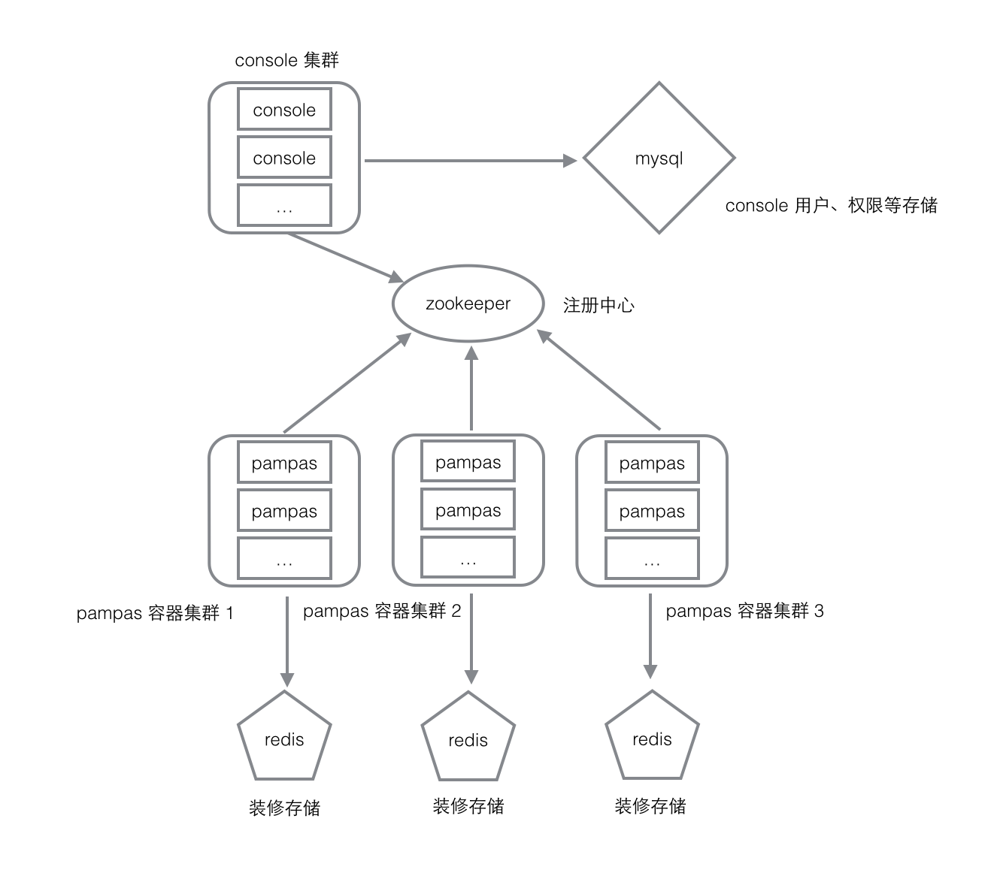

# Pampas 做了什么？

Pampas 集成并扩展了 Handlebars 模板技术，支持的主要特性有：

-   传统 SpringMVC 方式，通过在 controller 层返回 view 路径渲染
-   统一入口，通过访问时的 path 直接获取 view 路径进行渲染
-   前端资源可独立部署，可支持本地文件、http 、servlet 路径、classpath 路径多种协议
-   对 Handlebars 进行增强，提供多个实用的 helper 并提供扩展点
-   为前端模块化开发提供支持
-   基于前端模块化的装修系统支持

Pampas 封装了一套服务调用体系，可以非常简单的将 web 层的请求映射到服务执行：

-   支持 http url 映射到服务
-   支持组件映射到服务
-   支持智能的上下文参数获取和转换
-   支持映射到 spring bean 或者 dubbo
-   支持无 jar 的 dubbo 调用

Pampas 提供了一个中心化的 console ，为运行时提供监控和功能入口：

-   查看应用健康状况（待补充）
-   查看应用配置文件加载状况，配置文件详情以及警告信息
-   提供装修入口

Pampas 制定了一套组件化的开发方式，并进而支持了所见即所得的页面编辑和配置方式，通过一些工具辅助这个过程

-   Linner：支持组件化开发的前端打包器
-   Jigglypuff：fake pampas http server ，支持前期的前端快速开发
-   Eevee：装修系统前端工程，嵌入在 console 中

# Pampas 技术概述

## 结构

Pampas 主体分为下属几个模块

-   pampas-client 供发布服务的业务系统依赖的客户端，用于代理服务访问
-   pampas-common 一些通用 modal 和工具类等，pampas 内部使用
-   pampas-console 控制台，发布为 war 包，可中心化的监视和控制多组 pampas 实例，包含装修系统前端部分
-   pampas-design 与装修相关的所有后端逻辑，使用时需要依赖 redis
-   pampas-design-api 与装修相关服务的 api ，由 pampas-design 依赖
-   pampas-engine 核心容器逻辑
-   pampas-engine-api 核心容器 api 由 pampas-engine 依赖

其中 pampas-client 对于提供服务的业务系统是必选的；pampas-engine 是整个运行时必须的基础；当需要装修功能时可以可选的方式依赖 pampas-design ；pampas-console 则独立部署。

## 使用的中间件

-   zookeeper 作为 dubbo 和 pampas 本身的注册中心使用，pampas-console 通过 zookeeper 来发现运行中的 pampas 实例。
-   redis 作为装修系统的存储使用，只有支持装修功能的 pampas 实例会用到 redis 。
-   mysql 作为 pampas-console 的存储使用，存储 console 的用户和权限关系。（暂不需要，实现中）

上述三者的存储压力都很小。

以下是一个典型的 pampas 系统结构图：

其中 pampas 容器也可以不使用装修进而不依赖 redis ，进而还可以不向 zookeeper 注册而成为一个独立的节点。

这种情况下的 pampas 容器即为一个最小的运行时单元。

## 部署环境

console 作为一个内部非核心应用，可单实例部署（每个 zookeeper 集群一个实例）。

pampas 容器试需要可部署多集群，每集群不限实例数量，推荐至少双实例互为备份。但对于中心化的部署方式，不建议一个集群中实例更多，并托管过多 app ，应当减小粒度，降低风险。

zookeeper 与 dubbo 注册中心共用（三实例以上做集群即可）。

redis 为每一个需要装修的 pampas 容器集群部署一组主备即可，不建议在两组 pampas 容器集群间共享 redis（可能出现同名 app 导致冲突，如一定要共享则应该使用不同的 database No.）。

## 交互逻辑

pampas 容器在启动时，会注册信息到 zookeeper 上，并开放供 console 调用的 dubbo 接口。

console 在启动后，通过 zookeeper 发现所有注册上来的 pampas 容器，并基于 zookeeper 上的元信息获取这些 pampas 容器的 dubbo 调用地址。

console 全部通过 dubbo 接口来完成对 pampas 容器的控制。

如需使用装修，需保证 console 所在机器能通过 http 访问到对应需装修 app 所配置的资源路径。

详细内容请查看 [console 如何工作](./how_console_works.md)。

## 数据隔离策略

使用同一组 zookeeper 集群的 pampas 容器集群，应该使用不同的 dubbo application name ，console 使用此名称作为 pampas 容器集群的 group name 。

在同一组 pampas 集群中，每个 app 拥有集群内惟一的 appKey ，redis 中的数据会根据这个 appKey 做隔离，也因此如果多个集群共用一个 redis 则可能导致 appKey 冲突。
